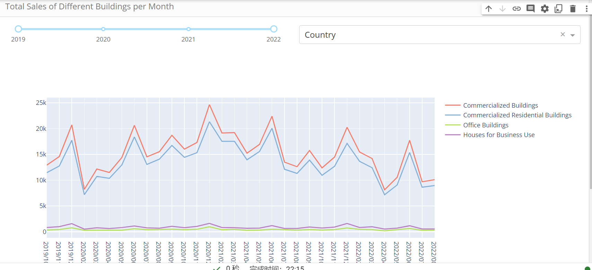
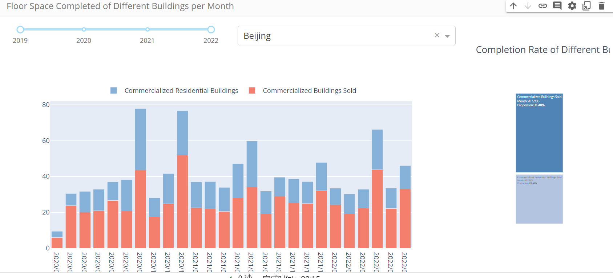

# Real Estate Market Visualization
# 该项目为数据可视化课程小组项目， 主要研究房地产行业相关指标变化，我负责实现月度数据可视化，即monthlydatapage
* ./dashboard
  * This visualization project contains four pages and the dash layout of them stored in: 
    * DevelopmentPage.py
    * SalePage.py 
    * InvestmentPage.py
    * MonthlydataPage.py
  * figure.py is the code for generating different figure in that pages
  * Other file can be ignored
* Preview of some figures:

